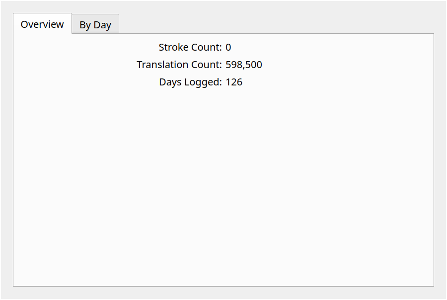
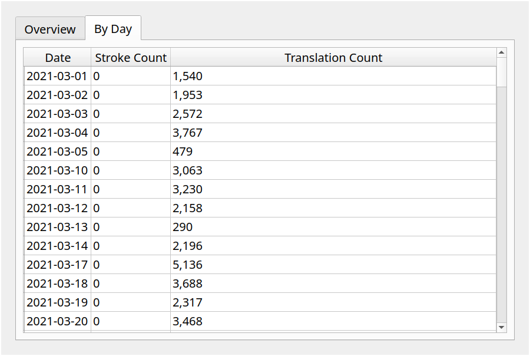
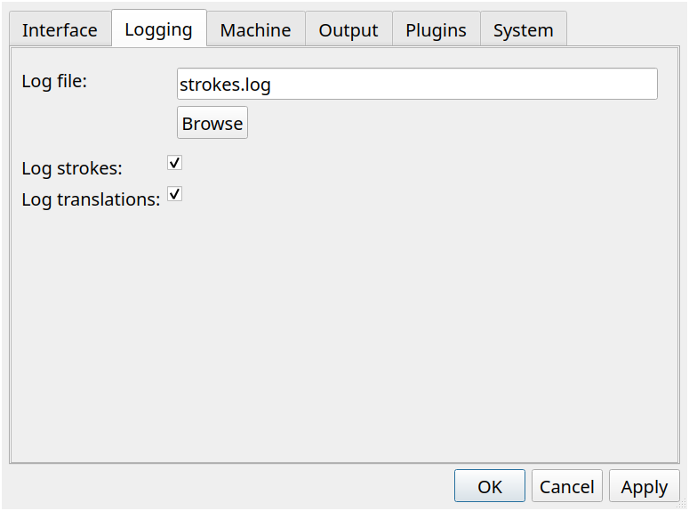

# Plover Stats

Plover stats reads your `strokes.log` and give you some stats.




### Table of Contents
- [Installation](#installation)
- [Setup](#setup)
- [Usage](#usage)

## Installation

### Git version

On the [command-line](https://plover.readthedocs.io/en/latest/cli_reference.html) (requires git):

```bash
plover -s plover_plugins install git+https://github.com/antistic/plover_stats.git
```

### For development

```bash
git clone https://github.com/antistic/plover_stats
cd plover_stats
plover -s plover_plugins install -e .
```

## Setup

Make sure you have logging turned on.
For full stats, enable both strokes and translation logging.
For now, Plover Stats assumes you're using the default path `strokes.log`.



## Usage

Open up "Stats" in the toolbar or in the menu. Depending on how long your log files are,
it may take some time to load.
